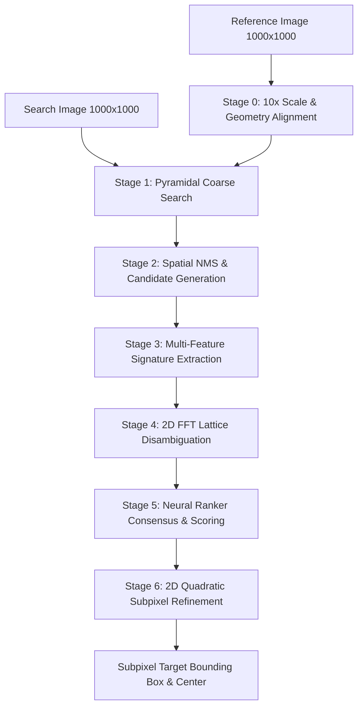

# DriftSense-X Architecture Overview

## Executive Summary

DriftSense-X is an industrial-grade Physics-Aware AI Navigation-Error Recovery pipeline designed for Scanning Electron Microscopy (SEM) wafer inspection tools at Applied Materials.

It resolves sub-resolution semiconductor feature alignment errors (translation drift, periodic lattice aliasing, secondary electron charging, beam noise) between a 1000x1000 Reference wafer pattern and a 1000x1000 Search wafer image.

---

## High-Level System Architecture

---

## Pipeline Components

### 1. Dataset Generation Engine (`dataset_generator/`)
- **FinFET Generator**: Generates silicon fin channels and cross-gate electrodes with process variation jitter.
- **DRAM Generator**: Generates word line / bit line grid matrices and bright contact dot arrays.
- **SEM Simulation**: Edge brightening (secondary electron emission), Poisson shot noise, Gaussian sensor noise, scan-line artifacts, and geometric affine warping.

### 2. Multi-Stage Localization Engine (`localization/`)
- **Pyramidal Coarse Search**: Downsampled Sobel gradient and variance correlation for fast anchor estimation.
- **Lattice Disambiguation**: 2D autocorrelation / FFT phase estimation for breaking spatial periodicity aliases.
- **Multi-Feature Ranking**: 56-D / 44-D feature vector fusion across local NCC, Sobel NCC, Canny edge overlap, LoG, macro context, and phase correlation.
- **2D Quadratic Subpixel Refinement**: Parabolic interpolation around winner peak for subpixel precision.

### 3. PyTorch Neural Models (`models/`)
- **Siamese CNN**: Shared convolutional encoder for L2-normalized 32-D patch embeddings.
- **Hybrid Ranker**: Multi-layer perceptron trained with Triplet Margin Ranking loss.
- **Coordinate-Aware Ranker**: Positional encoding and lattice phase neural network.
- **Context Transformer**: Multi-scale spatial field attention model.

---

## Component Interfaces

All components communicate through standardized Python signatures and structured dataclasses defined in `configs/`.
